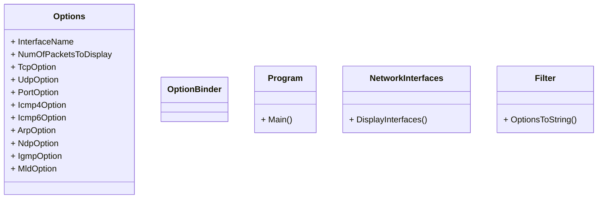

# IPK Projekt 2
Cie¾om projektu je implementova� paketovı sniffer, ktorı bude schopnı zachyti�, filtova� a zobrazi� pakety na na špecifickom sie�ovom rozhraní.

## Štruktúra projektu
Projek bol vypracovanı v jazyku C# a bol štrukturovanı do viacerich tried. Zákldnou triedou je `Program`, ktorá obasuje funkciu `Main`, ktorá je vstupnım bodom programu. Triedy `CommandLineOptions`, `OptionBinder` a `Options` s pomocou kni�nice `System.CommandLine` sprcuvávajú agrmunty príkazového riadku. Trieda `NetworkInterfaces` zobrazuje aktuálne sie�ové rozhrania. Trieda `PacketSniffer` a kni�nica `SharpPcap` zachytávajú pakety, následne ich filtrujú a analyzujú. Trieda `Filter` je pomocná trieda, krorá trasformuje vstupné argumenty na re�azec, ktorı filtruje prichádzajúce pakety.

## UML Diagram

## Teória
V nasledujúcej èasti struène zhrniem teóriu nutnú k pochopeniu implementovanej funkcionality. Zameriam sa hlavne na to èo je to paketovı sniffer a ako sa dá pou�i�. Vychádza� budem zo zdroja [1].

### Paketovı sniffer
Paketovı sniffer je vo¾ne dostupnı nástroj, ktorı doká�e zachyti� a analyzova� pakety s konkrétneho sie�ového rozhrania. Jednım z najznámejších je Wireshark.

### Bezpeènos�
Zachytávanie paketov predsatavuje potenciálne bezpeènostné riziká, preto�e pakety posielané po sieti mô�u obsahova�, citlivé informácie, ako napríklad heslá, osobné informácie, súkromné správy a iné. Keï�e je paketovı sniffer pasívny nástroj, nevkladá pakety do sie�ového kanálu, je �a�ko detekovate¾nı. To znamená, �e ak posielame dáta po sieti, musíme akceptova� mo�nos�, �e si útoèník mô�e urobi� kópiu našeho paketu. Najlepšou obranou proti paketovım snifferom je kryptografia a šifrovanie paketov.

## Testovanie

## Bibliografia
[1] KUROSE James F. a Keith W. ROSS. <em>Computer networking: a top-down approach</em>. Eighth edition.; Global edition. Harlow: Pearson Education Limited, 2022, ISBN 978-1-292-40546-9. 