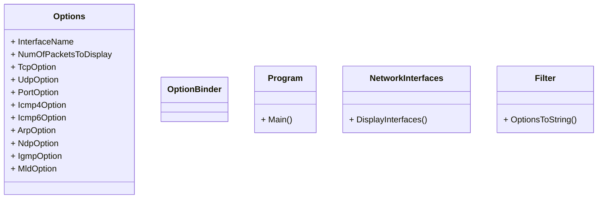

# IPK Projekt 2
Cieľom projektu je implementovať paketovť sniffer, ktorý bude schopný zachytiť, filtovať a zobraziť pakety na špecifickom sieťovom rozhraní.

## Štruktara projektu
Projek bol vypracovaný v jazyku C# a bol štrukturovaný do viacerich tried. Zákldnou triedou je `Program`, ktorá obasuje funkciu `Main`, ktorá je vstupným bodom programu. Triedy `CommandLineOptions`, `OptionBinder` a `Options` s pomocou knižnice `System.CommandLine` sprcuvávajú argumenty príkazového riadku. Trieda `NetworkInterfaces` zobrazuje aktuálne sieťové rozhrania. Trieda `PacketSniffer` a knižnica `SharpPcap` zachytávajú pakety, následne ich filtrujú a analyzujú. Trieda `Filter` je pomocná trieda, krorá trasformuje vstupné argumenty na reťazec, ktorý filtruje prichádzajúce pakety.

## UML Diagram

## Teória
V nasledujúcej časti stručne zhrniem teóriu nutnú k pochopeniu implementovanej funkcionality. Zameriam sa hlavne na to čo je to paketový sniffer a ako sa dá použiť. Vychádzať budem zo zdroja [1].

### Paketový sniffer
Paketový sniffer je voľne dostupný nástroj, ktorý dokáže zachytiť a analyzovať pakety s konkrétneho sieťového rozhrania. Jedným z najznámejších je Wireshark.

### Bezpečnosť
Zachytávanie paketov predsatavuje potenciálne bezpečnostné riziká, pretože pakety posielané po sieti môžu obsahovať, citlivé informácie, ako napríklad heslá, osobné informácie, súkromné správy a iné. Keďže je paketový sniffer pasívny nástroj, nevkladá pakety do sieťového kanálu, je ťažko detekovateľný. To znamená, že ak posielame dáta po sieti, musíme akceptovať možnosť, že si útočník môže urobiť kópiu našeho paketu. Najlepšou obranou proti paketovým snifferom je kryptografia a šifrovanie paketov.

## Testovanie

## Bibliografia
[1] KUROSE James F. a Keith W. ROSS. <em>Computer networking: a top-down approach</em>. Eighth edition.; Global edition. Harlow: Pearson Education Limited, 2022, ISBN 978-1-292-40546-9. 
