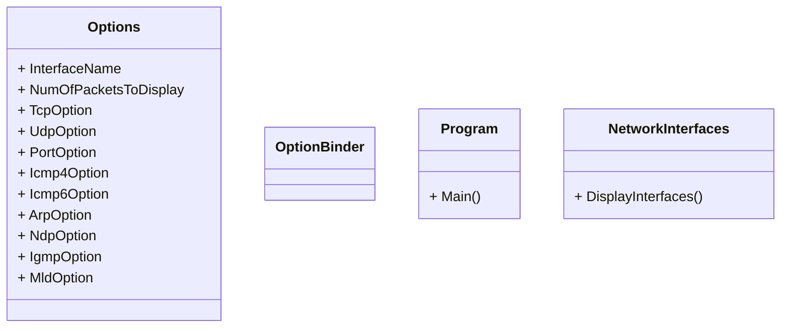

# IPK Projekt 2
Cieľom projektu je implementovať paketový sniffer, ktorý bude schopný zachytiť, filtovať a zobraziť pakety na špecifickom sieťovom rozhraní.

## Štruktara projektu
Projek bol vypracovaný v jazyku C# a bol štrukturovaný do viacerich tried. Zákldnou triedou je `Program`, ktorá obasuje funkciu `Main`, ktorá je vstupným bodom programu. Triedy `CommandLineOptions`, `OptionBinder` a `Options` s pomocou knižnice `System.CommandLine` sprcuvávajú argumenty príkazového riadku. Trieda `NetworkInterfaces` zobrazuje aktuálne sieťové rozhrania. Trieda `PacketSniffer` a knižnica `SharpPcap` zachytávajú pakety, následne ich filtrujú a analyzujú.

## UML Diagram


## Teória
V nasledujúcej časti stručne zhrniem teóriu nutnú k pochopeniu implementovanej funkcionality. Zameriam sa hlavne na to čo je to paketový sniffer a ako sa dá použiť. Vychádzať budem zo zdroja [1].

### Paketový sniffer
Paketový sniffer je voľne dostupný nástroj, ktorý dokáže zachytiť a analyzovať pakety s konkrétneho sieťového rozhrania. Jedným z najznámejších je Wireshark.

### Bezpečnosť
Zachytávanie paketov predsatavuje potenciálne bezpečnostné riziká, pretože pakety posielané po sieti môžu obsahovať, citlivé informácie, ako napríklad heslá, osobné informácie, súkromné správy a iné. Keďže je paketový sniffer pasívny nástroj, nevkladá pakety do sieťového kanálu, je ťažko detekovateľný. To znamená, že ak posielame dáta po sieti, musíme akceptovať možnosť, že si útočník môže urobiť kópiu našeho paketu. Najlepšou obranou proti paketovým snifferom je kryptografia a šifrovanie paketov.

## Testovanie
Testovanie bolo uskutočnené pomocou automatizovaných testov v prostredí Xunit. Implementované testy sa nachádzajú v zložke tests v ktorej bol zavolaný príkaz `dotnet test`. Aplikácia bola testovaná v offline režime, to znamená, že sieťovú komunikáciu čítala z .pcap súborov, ktoré sa nachádzajú v zložke pcap. Aplikácia bola testovaná v poskytnutom virtuálnom stroji s operačným systémom Linux (distribúcia NixOS 22.11 Raccoon). Testy boli spúšťané na zariadení Dell Latitude 5491 (Intel Core i7, 8GB RAM DDR4, 256GB SSD). Testovaná aplikácia bola vo verzii 1.0.0.

Vystup z testovania:
```
[root@ipk-vm:/home/ipk/IPK-Projekt-2/tests]# dotnet test
  Determining projects to restore...
  All projects are up-to-date for restore.
  ipk-sniffer -> /home/ipk/IPK-Projekt-2/src/bin/Debug/net6.0/linux-x64/ipk-sniffer.dll
  ipk-sniffer-tests -> /home/ipk/IPK-Projekt-2/tests/bin/Debug/net6.0/ipk-sniffer-tests.dll
Test run for /home/ipk/IPK-Projekt-2/tests/bin/Debug/net6.0/ipk-sniffer-tests.dll (.NETCoreApp,Version=v6.0)
Microsoft (R) Test Execution Command Line Tool Version 17.3.1 (x64)
Copyright (c) Microsoft Corporation.  All rights reserved.

Starting test execution, please wait...
A total of 1 test files matched the specified pattern.

Passed!  - Failed:     0, Passed:     5, Skipped:     0, Total:     5, Duration: 32 ms - /home/ipk/IPK-Projekt-2/tests/bin/Debug/net6.0/ipk-sniffer-tests.dll (net6.0)
```

## Bibliografia
[1] KUROSE James F. a Keith W. ROSS. <em>Computer networking: a top-down approach</em>. Eighth edition.; Global edition. Harlow: Pearson Education Limited, 2022, ISBN 978-1-292-40546-9.<br/>
